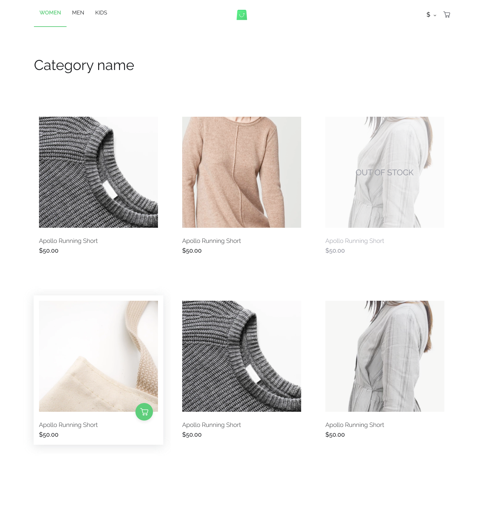
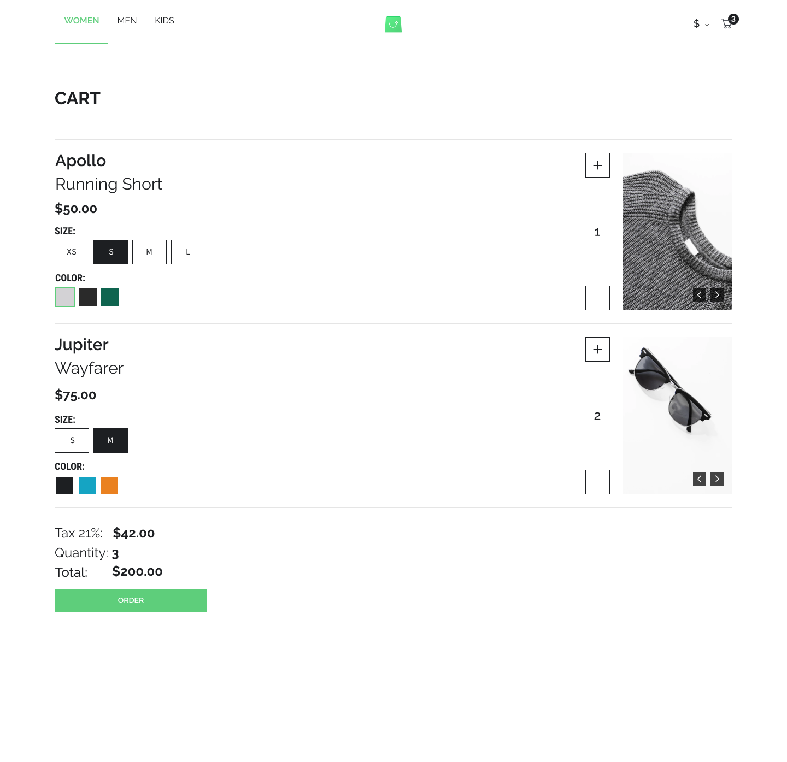
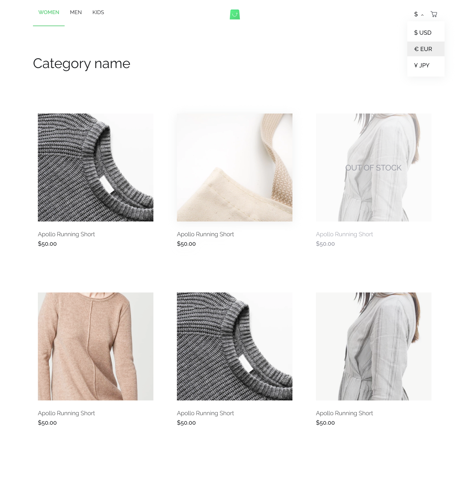
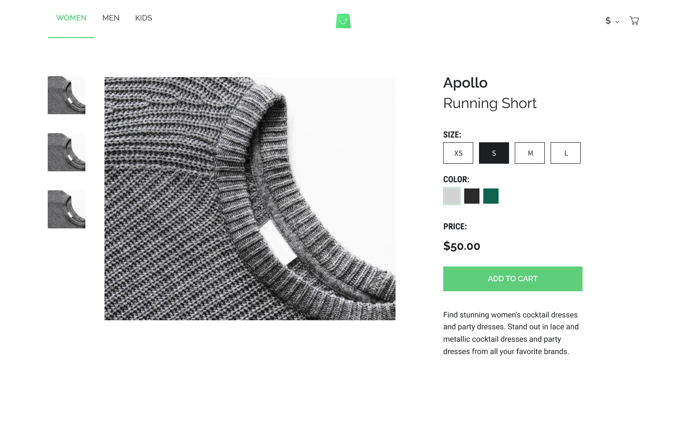

# Shopping Cart using react

## The challenge

[Instructions](<https://www.figma.com/file/MSyCAqVy1UgNap0pvqH6H3/Junior-Frontend-Test-Designs-(Public)?node-id=0%3A1)

Design the screens and implement checkout with Paystack:

- Ensure the use of redux for state management
- Ensure the use of typescript
- Ensure Clarity in codebase
- Ensure The single responsibility pattern is adhered to
- Ensure the DRY design pattern is taken into consideration

## How to run the app

Download the zip file using the green button, or clone the repository by running the command `git clone https://github.com/Nierowheezy/myshoppingcart` in your terminal.
In the same terminal once the command is complete, run `npm install` which will install all the dependencies in the `package.json` file and then run `npm start` which will start your development server on `localhost:3000`.
